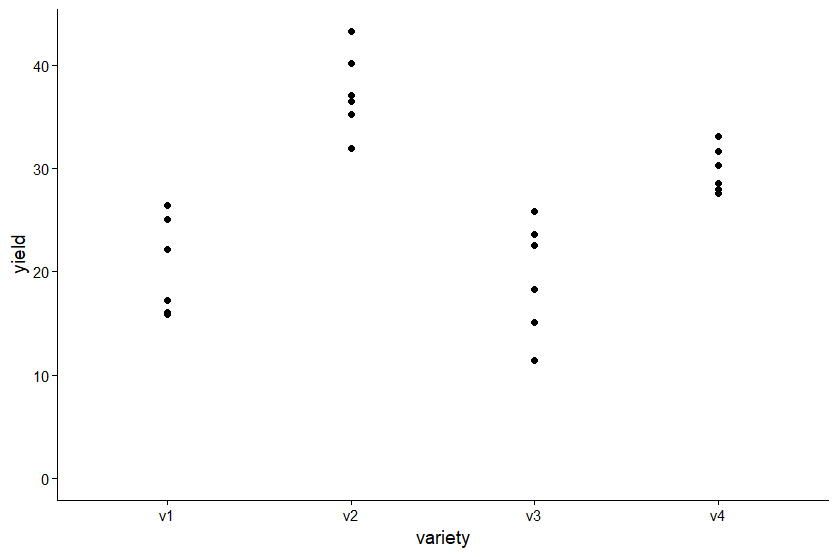

สำหรับการทดลงแบบ CRD ในยุคปัจจุบันนี้ สนับสนุนให้การรายงานควรที่จะแสดง “ค่าประมาณ + 95% CI” และ ขนาดเอฟเฟกต์ (η²/ω²) มากกว่าดูจากค่า *p*-value อย่างเดียว

พยายามรวบรวม วิธีการวิเคราะห์ข้อมูลสถิติกับการทดลองที่ออกแบบ แบบ CRD ด้วย R code โดยพยายามให้โค้ดมีความทันสมัยและอยู่ในรูปแบบการโค้ด package ที่เป็นปัจจุบัน มชมากที่สุด

เรามาเริ่มกันโค้ดเลย

## 1. โหลด package ที่จำเป็น
```r
# packages
pacman::p_load(
  tidyverse, # data import and handling
  conflicted, # handling function conflicts
  emmeans,
  multcomp,
  multcompView, # adjusted mean comparisons
  ggplot2,
  effectsize, # effect size calculation
  desplot, # for plotting experimental designs
  rstatix,
  ggdist,
  performance,
  see
) # plots

# conflicts between functions with the same name
conflict_prefer("filter", "dplyr")
conflict_prefer("select", "dplyr")
```

`pacman::p_load` เป็น package ที่ช่วยให้เราโหลด package ได้ง่ายขึ้น โดยไม่ต้องโหลดทีละตัว

`tidyverse` ช่วยจัดการข้อมูลได้ง่ายขึ้น
`conflicted` ช่วยจัดการ function conflicts ซึ่ง เมื่อประกาศใช้ tidyverse แล้ว จะมี function ซ้ำกันหลายตัวกับ R base อยู่ เพื่อไม่ให้เกิดความขัดแย้งกันเองก็เลือกเลยว่าจะให้อะไรจาก package ไหน

`emmeans` ช่วยให้เราจัดการ adjusted mean comparisons ได้ง่ายขึ้น `multcomp` ช่วยให้เราจัดการ adjusted mean comparisons ได้ง่ายขึ้น `multcompView` ช่วยให้เราจัดการ adjusted mean comparisons ได้ง่ายขึ้น `effectsize` ช่วยให้เราจัดการ effect size calculation ได้ง่ายขึ้น

เพื่อตรวจสอบสมมุติฐานของ ANOVA

`desplot` ช่วยให้เราจัดการ for plotting experimental designs ได้ง่ายขึ้น

`rstatix` ช่วยให้เราจัดการ rstatix ได้ง่ายขึ้น

`ggdist` ช่วยให้เราจัดการ ggdist ได้ง่ายขึ้น

`performance` ช่วยให้เราจัดการ performance ได้ง่ายขึ้น

`see` ช่วยให้เราจัดการ see ได้ง่ายขึ้น

## 2. การนำเข้าข้อมูล

ตัวอย่างข้อมูลที่นำมาให้ใช้ เป็น ข้อมูลที่มาทำได้เป็นงานวิจัยทดสอบผลผลิตเมลอน ตีพิมพ์ Mead et al. (1993, p.52) โดยการทดลองมีพันธุ์เมลอน 4 พันธุ์ แต่ละพันธุ์ได้รับการทดสอบในแปลงทดลองจำนวน 6 แปลง ออกแบบการทดสอบแบบ สุ่มสมบูรณ์ (CRD) จาก “Example 4.3” หนังสือ “Quantitative Methods in Biosciences (3402-420)” by Prof. Dr. Hans-Peter Piepho

```r
#| label : "Import data"
dataURL <- "https://raw.githubusercontent.com/SchmidtPaul/DSFAIR/master/data/Mead1993.csv"
dat <- read_csv(dataURL)
dat %>% head()
```
ผลลัพธ์ที่ได้
```
variety yield   row   col
   <chr>   <dbl> <dbl> <dbl>
 1 v1       25.1     4     2
 2 v1       17.2     1     6
 3 v1       26.4     4     1
 4 v1       16.1     1     4
```
และต่อไปเราเพื่อที่จะวิเคราะห์ ANOVA จะต้องแปลง `variety` ให้เป็น `factor` ก่อน
```r
dat <- dat %>%
  mutate(variety = as.factor(variety))
```
ได้
```
# A tibble: 24 × 4
   variety yield   row   col
   <fct>   <dbl> <dbl> <dbl>
 1 v1       25.1     4     2
 2 v1       17.2     1     6
 3 v1       26.4     4     1
 4 v1       16.1     1     4
```
ขอดูกราฟก่อนว่า หน้าตาของข้อมูลเป็นอย่างไร

```r
ggplot(data = dat, aes(y = yield, x = variety)) +
  geom_point() + # scatter plot
  ylim(0, NA) + # force y-axis to start at 0
  theme_classic() # clearer plot format
```


จากตรงนี้ก็พอจะเห็นอะไรบ้างว่าพันธุ์แต่ละพันธุ์นั้น มีแนวโน้มที่ให้ผลผลิตที่แตกต่างกัน

## 3. วิเคราะห์ ANOVA

อันนี้แหละ ที่เป้นประเด็น ในการเรื่องการวิเคราะห์ ANOVA 
Modern ANOVA = `car::Anova(type = 3)`

```r
fit <- lm(yield ~ variety, data = dat)
car::Anova(fit, type = 3)
```

ถ้าเป็น code แบบ classic ก็ใช้ `aov(yield ~ variety, data = dat)` ซึ่ง ถ้าเป็น ปัจจุบันตอนนี้ เราจะนิยมและปลอดภัยสุด หรือ ANOVA type จาก [Data Science for Agriculture in R](https://schmidtpaul.github.io/dsfair_quarto/ch/summaryarticles/anovatypes.html)

> In most cases it’s probably best to conduct a `Type III` ANOVA, e.g. via `car::Anova(model, type = "III")`.

## classic ANOVA

แบบ ANOVA จาก R base ก็ใช้ได้เช่นกัน นะ

```r
#| eval : false
aov.model <- aov(yield ~ variety, data = dat)
summary(aov.model)
```

ถ้า ไม่ sig เราก็ จะรายงาน เท่านี้ แต่ถ้าไม่ ส่วนใหญ่ เราก็จะไปทดสอบต่อ อย่างที่เรา เรียกกัน postpoc

### ตรวจ Asusumption

ใช้ `performance` library หรือ `easystat` library เพื่อ check สมมุติฐาน และคุณภาพของข้อมูล ที่นำไปวิเคราะห์ ANOVA

1.  Homogeneity check

```r
performance::check_homogeneity(fit)
performance::check_homogeneity(fit) %>% plot()
```

2.  heteroscedasticit check

```r
performance::check_heteroscedasticity(fit)
performance::check_heteroscedasticity(fit) %>% plot()
```

บอกว่าต้องเชคอันนี้ก่อน เพราะว่ามันจะมีผลต่อ การวิเคราะห์ ANOVA เพราะว่า ถ้าไม่ ก็ ควรใช้ Welch ANOVA แทน

3.  Normality check

```r
performance::check_normality(fit)
performance::check_normality(fit) %>% plot()
```

หลายคนอยากดู outlier

```r
check_outliers(fit) %>% plot()
```

### ขนาดเอฟเฟกต์

อยากจะชวนให้ ดู effect ต่อ สำคัญอย่างไร - *p*-value บอกแค่ว่า “มีหลักฐานต่างกันไหม” ซึ่งไวต่อ ขนาดตัวอย่าง มาก แต่ ไม่บอกว่าผลที่ได้นั้นต่างกันมากขนาดไหน - ขนาดเอฟเฟกต์บอก “ผลที่ได้ใหญ่พอจะมีความหมายเชิงปฏิบัติไหม” และทำให้ เปรียบเทียบงาน/การทดลองต่างกันได้ บนมาตรฐานเดียว

```r
effectsize::eta_squared(fit)
effectsize::omega_squared(fit)
```

ค่า omega square (variance explained): “ทรีตเมนต์อธิบายความแปรปรวนได้ \~73% (ω²=0.73) ผลต่างเห็นได้ชัด (รู้สึกมั่นใจว่าผลการทดลองที่ได้สังเกตเห็นผลต่างได้ชัดเจน)”

## post-hoc test

แม้ปัจจุบัน นักสถิติหลายคน ไม่ค่อย สนับสนุนให้ ทำ CLD(compact letter dusplay) เพราะว่า ... แล้ว แต่ในสาขาเกษตรหรือชีววิทยา ก็ยังคงนิยมเพระาว่า ง่ายในการอธิบายผล ดังนั้น เราจะยังใช้

### ประมาณค่าเฉลี่ยเปรียบเทียบ โดยการใช้ตัวอักษร

```r
emm <- emmeans(fit, ~variety)
contrast(emm, "pairwise", adjust = "tukey")
```

ตารางข้างบ้นนี้ เปรียบเทียบทีละคู่ ๆ

### เปรียบเทียบโดยการใช้ตัวอักษร CLD

```r
mean_comparisons <- fit %>%
  emmeans(specs = "variety") %>%
  cld(adjust = "tukey", Letters = letters)

mean_comparisons
```

### กราฟเปรียบเทียบตัวแปร

```r
ggplot(mean_comparisons, aes(variety, emmean)) +
  ggdist::geom_pointinterval(
    aes(ymin = lower.CL, ymax = upper.CL)
  ) +
  labs(
    x = "Treatment",
    y = "Estimated mean (95% CI)",
    title = "CRD: EMMs + 95% CI"
  ) +
  theme_minimal(base_size = 13)
```

```r
my_caption <- "Black dots = raw data (jittered). Red dots/bars = adjusted means with 95% CIs per variety. Letters share = not different (Tukey)."

ggplot() +
  aes(x = variety) +

  # จุดดิบ: jitter ป้องกันทับกัน + alpha ให้โปร่ง
  geom_point(
    data = dat,
    aes(y = yield),
    position = position_jitter(width = 0.08, height = 0),
    alpha = 0.6,
    size = 1.9
  ) +

  # ค่ากลางและช่วงเชื่อมั่น (ใช้ pointrange แทน point + errorbar แยก)
  geom_pointrange(
    data = mean_comparisons,
    aes(y = emmean, ymin = lower.CL, ymax = upper.CL),
    color = "red",
    fatten = 1.1,
    size = 0.6,
    position = position_nudge(x = 0.12)
  ) +

  # ตัวอักษร CLD: ขยับไปขวาอีกหน่อย และยกขึ้นเล็กน้อย
  geom_text(
    data = mean_comparisons,
    aes(y = emmean, label = .group),
    color = "red",
    position = position_nudge(x = 0.24),
    hjust = 0,
    vjust = -0.3,
    fontface = "bold",
    size = 3.6
  ) +

  # แกนและสเกล
  scale_x_discrete(name = "Variety", expand = expansion(mult = c(0.02, 0.22))) +
  scale_y_continuous(
    name = "Yield",
    limits = c(0, NA),
    expand = expansion(mult = c(0, 0.08))
  ) +

  # ธีมสะอาด + ระยะขอบเผื่อข้อความ
  theme_classic(base_size = 12) +
  theme(
    plot.margin = margin(t = 8, r = 24, b = 8, l = 8),
    axis.text.x = element_text(angle = 0, vjust = 1, hjust = 0.5),
    plot.caption = ggtext::element_textbox_simple(margin = margin(t = 6)),
    plot.caption.position = "plot"
  ) +
  labs(caption = my_caption) +
  coord_cartesian(clip = "off")
```

## วิธีรายงานผล
รายงาน ความต่างเฉลี่ยที่สนใจ พร้อมค่า 95% CI และวิธี post-hoc test (เช่น Tukey) ใส่ขนาดเอฟเฟกต์ (เช่น partial η² หรือ ω²) เพื่อสื่อสาร
